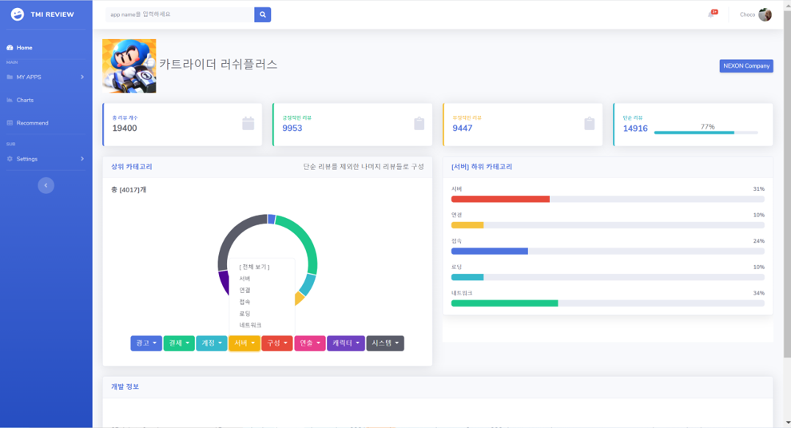
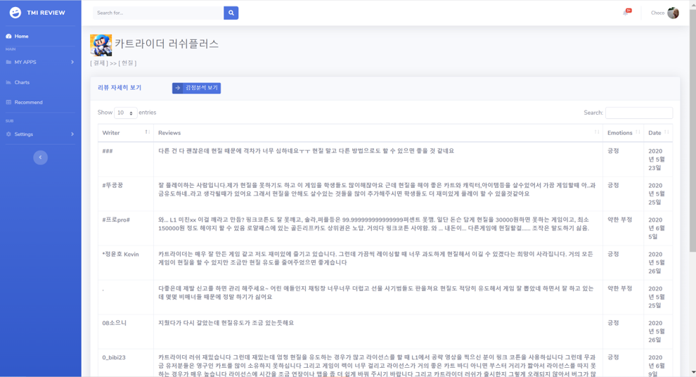
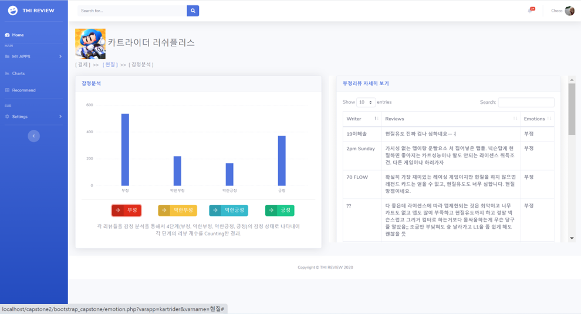

# < 20-1 Capstone Design Project >

## 단어 유사도 측정을 통한 게임 어플리케이션 분석 " TMI Review "

- 2020년도 1학기 제 9회 세종대 창의경진설계대회 `장려상` 수상
- 최종 발표 영상 <a href="https://youtu.be/VK112fAfW9A">Youtube 링크</a>

 

## 팀원

|이름|역할|
|---|---|
|<a>심재경</a>|📂 Crawling, Emotional Analysis|
|<a href="https://github.com/ghis22130">김지수</a>|📂 DB, Word Similarity Analysis |
|<a href="https://github.com/woogie-s">신현욱</a>|📄 Frontend, Word Similarity Analysis |

 

## 프로젝트 소개
1. "TMI Review"는 모바일 게임 어플리케이션 개발자들을 위한 `모바일 게임 어플 리뷰 분석` 사이트입니다.
2. 개발자들은 유저들의 피드백을 통해 어플리케이션을 더 발전시켜나가곤 합니다. 이때, 유사도에 따른 분석 결과를 통해 접근하고자 하는 리뷰에 쉽게 접근할 수 있게 하여 `빠른 피드백`이 가능하도록 하는 것이 목표입니다.
3. Google Play Store 내의 게임 어플리케이션 리뷰에 대해 분석을 진행하였으며, 유사도에 따른 카테고리 분류와 리뷰의 감정 상태를 분석하였습니다.
4. `단어 유사도`에 따른 리뷰 분류는 `8개의 대분류` 카테고리로 나뉘어지고, 또 그 안에서 `5개의 소분류` 카테고리로 세분화하여 찾고자 하는 리뷰를 쉽게 찾을 수 있도록 하였습니다.
5. Train Data를 이용해 Word2Vec 모델을 적용시켰고, 이 후 Test Data로 단어 간 유사도에 따른 카테고리 분류가 이루어지는 것을 확인할 수 있었습니다.
6. 또한, 유사도 분석과 더불어 리뷰의 긍정, 부정 상태에 대한 `감정 분석`을 진행하였습니다.
7. 딥러닝 모델을 학습하고 적용시켜 나온 결과를 총 `4단계(부정, 약한 부정, 약한 긍정, 긍정)`의 감정 상태로 리뷰들을 분석하였습니다.
8. 이와 같은 분석 결과를 `시각화`하기 위해 웹사이트에 Pie-Chart, Bar-Graph 등의 여러가지 차트를 사용하였고, 이를 통해 사용자가 해당 어플리케이션에 대한 분석 결과를 한 눈에 보기 쉽게하고자 하였습니다.
9. 자세한 내용은 <a href="/Documents">이 곳</a>의 문서들을 통해 확인하실 수 있습니다.
10. 또한, 분석에 대한 코드는 <a href="/reviewAnalysis">여기</a>, 웹사이트에 대한 내용은 <a href="/TMI_Review">여기</a>에서 확인하실 수 있습니다.

 

<table style="text-align:center;">
    <tr>
        <th>리뷰 상세보기</th>
        <th>감정 분석</th>
        <th>차트 시각화</th>
    </tr>
    <tr>
        <td>
        
        </td>
        <td>
        
        </td>
        <td> 
        
        </td>

</table>

 

## 개발 환경

 

